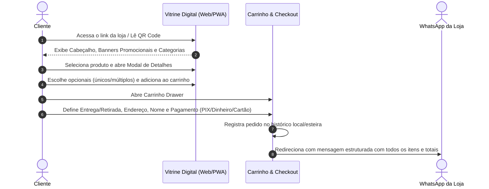
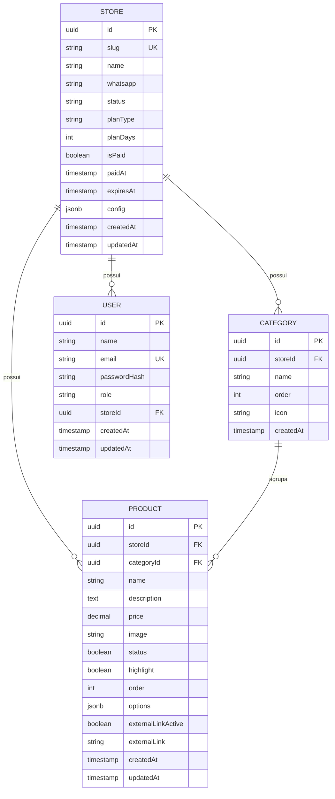

# Catálogo Express - Documentação Funcional do Sistema

> **Versão:** 1.0.0  
> **Arquitetura:** Clean Architecture, SOLID, Multi-tenant, PWA, SPA + API REST  
> **Status:** Produção  

---

## 1. Visão Geral do Produto

O **Catálogo Express** é uma plataforma completa e moderna de catálogo digital interativo e gestão de pedidos para pequenos, médios e grandes negócios. O sistema foi desenvolvido para eliminar a dependência de plataformas de marketplace tradicionais e taxas abusivas, proporcionando ao lojista um canal direto de vendas integrado ao **WhatsApp**, com experiência nativa de aplicativo (**PWA**), personalização visual por nicho e um poderoso painel de gestão operacional.

### 1.1 Proposta de Valor
- **Sem Intermediários:** Pedidos enviados diretamente para o WhatsApp do estabelecimento, já formatados e calculados.
- **Multi-Nicho Instantâneo:** Adaptação dinâmica de vocabulário, campos, temas visuais e categorias de acordo com o segmento (Restaurantes, Hamburguerias, Pizzarias, Moda, Cosméticos, Eletrônicos, Serviços, etc.).
- **Multi-Tenant Real:** Suporte a múltiplas lojas independentes gerenciadas por um painel Superadmin global.
- **Experiência Mobile-First & PWA:** Interface ultrarrápida, instalável na tela inicial do cliente e do lojista sem necessidade de loja de aplicativos.
- **Esteira de Pedidos Kanban:** Fluxo visual de atendimento desde o recebimento até a entrega.
- **Multicanal Híbrido:** Suporte a vendas locais e direcionamento externo para marketplaces (Shopee, Mercado Livre, Amazon) com rastreamento de cliques.

---

## 2. Perfis de Usuário e Níveis de Acesso

O sistema opera sob o modelo de controle de acesso baseado em papéis (**RBAC - Role-Based Access Control**):

```mermaid
graph TD
    SuperAdmin[👑 Superadmin] -->|Gerencia| TodasLojas[Todas as Lojas do Ecossistema]
    SuperAdmin -->|Gerencia| TodosUsuarios[Todos os Usuários da Plataforma]
    SuperAdmin -->|Controla| PlanosPagamento[Planos e Pagamentos]

    Owner[🏪 Lojista / Dono] -->|Configura| MinhaLoja[Sua Própria Loja]
    Owner -->|Gerencia| Catalogo[Produtos, Categorias e Banners]
    Owner -->|Opera| EsteiraPedidos[Esteira de Pedidos e Vendas]
    Owner -->|Customiza| IdentidadeVisual[Tema, Cores e Dados da Empresa]

    Staff[🧑‍🍳 Atendente / Equipe] -->|Opera| AtendimentoPedidos[Recebimento e Avanço de Pedidos]
    Staff -->|Consulta| CatalogoConsulta[Consulta de Produtos e Estoque]

    Cliente[🛒 Cliente Final] -->|Acessa via Link/QR Code| Vitrine[Vitrine Digital Pública]
    Cliente -->|Monta Carrinho| PedidoWhats[Envio de Pedido via WhatsApp]
```



| Papel | Escopo | Funcionalidades Principais |
| :--- | :--- | :--- |
| **Superadmin (`superadmin`)** | Global | Acesso ao `StoreManager`. Criação, duplicação e exclusão de lojas; liberação manual e controle de vencimento de planos (`isPaid`, dias restantes); listagem de todos os usuários cadastrados via `/api/users`. |
| **Lojista / Dono (`owner`)** | Tenant (sua loja) | Acesso total ao `AdminDashboard` da sua loja: gerenciamento de produtos, categorias, banners de promoção, esteira de pedidos, dados cadastrais, customização visual e backup. |
| **Equipe / Atendente (`staff`)** | Tenant (sua loja) | Acesso operacional para gerenciar o status dos pedidos em tempo real na esteira (`PedidosView`). |
| **Cliente Final (Público)** | Vitrine (`/loja-slug`) | Navegação pela vitrine, pesquisa de produtos, filtros por categorias, visualização de adicionais, carrinho de compras e checkout direto no WhatsApp. |

---

## 3. Módulos do Sistema e Fluxos Operacionais

### 3.1 Onboarding Wizard (Assistente de Configuração Inicial)
Quando uma nova loja é inicializada ou criada, o lojista passa por um fluxo guiado de 4 etapas para colocar sua loja no ar em menos de 3 minutos:

1. **Seleção de Nicho:** O lojista seleciona seu ramo de atividade (ex.: Alimentação, Moda, Pet Shop, etc.). O sistema carrega automaticamente termos sugeridos, paleta recomendada e estrutura de campos personalizados.
2. **Tema & Cores:** Escolha de paleta harmônica (com verificação automática de contraste e acessibilidade) e tipografia moderna.
3. **Identidade da Empresa:** Preenchimento de Nome Comercial, WhatsApp de atendimento, Endereço e Chave PIX para pagamentos instantâneos.
4. **Produtos Iniciais:** Cadastro rápido dos primeiros itens ou importação de catálogo de demonstração com um único clique.
5. **Publicação:** Geração imediata do link exclusivo da vitrine (`?loja=sua-loja`).

---

### 3.2 Vitrine Digital Pública (Experiência do Consumidor)
A vitrine pública foi construída com foco em conversão e usabilidade mobile:



#### Funcionalidades da Vitrine:
- **Header Informativo:** Logotipo, nome, badge de status (Aberto/Fechado), endereço com link para Google Maps, botão de contato direto e alternador de tema claro/escuro.
- **Carrossel Promocional (PromoSlider):** Banners dinâmicos com tags ("OFERTA DA SEMANA"), títulos, subtítulos, selos de desconto ("20% OFF") e botões de chamada com rotação automática customizável.
- **Navegação Rápida:** Filtro por categorias com rolagem horizontal fluida, busca textual em tempo real e filtro de "Apenas Destaques".
- **Modal de Detalhe do Produto:**
  - Imagem em alta definição e preço.
  - Grupos de opcionais de escolha **Única** (ex.: Ponto da carne, Tamanho) com seleção obrigatória/opcional.
  - Grupos de opcionais de escolha **Múltipla** (ex.: Adicionais de bacon, queijo extra, calda) com acréscimo automático de valores.
  - Botão especial para **Links Externos** (ex.: "Comprar na Shopee" ou "Ver no Mercado Livre") caso o produto seja vendido em marketplaces externos, acompanhado de contador de cliques para análise.
- **Carrinho Drawer Interativo:**
  - Ajuste de quantidade e remoção de itens em 1 clique.
  - Escolha entre **Entrega em Domicílio** (com campo de endereço e ponto de referência) ou **Retirada no Local**.
  - Seleção de forma de pagamento: **PIX**, **Cartão de Crédito/Débito**, ou **Dinheiro** (com campo de cálculo de troco).
  - Campo de observações gerais (ex.: "Sem cebola", "Tocar interfone 201").
  - Botão de envio que formata o pedido com Markdown limpo e abre o aplicativo oficial do WhatsApp no smartphone ou WhatsApp Web no computador.

---

### 3.3 Esteira de Pedidos (Gestão Operacional Kanban)
O módulo `PedidosView` oferece ao lojista controle absoluto sobre a produção e o despacho dos pedidos recebidos:

```
┌──────────────┐     ┌──────────────┐     ┌──────────────┐     ┌──────────────┐
│  1. RECEBIDO │ ──> │ 2. EM PREPARO│ ──> │ 3. A SAIR    │ ──> │ 4. CONCLUÍDO │
│   (#F59E0B)  │     │   (#3B82F6)  │     │   (#F97316)  │     │   (#10B981)  │
└──────────────┘     └──────────────┘     └──────────────┘     └──────────────┘
```

#### Destaques do Módulo de Pedidos:
- **Transição de Status em 1 Toque:** O atendente avança o pedido de forma progressiva com feedback visual instantâneo.
- **Métricas em Tempo Real:** Faturamento do dia, quantidade de pedidos abertos, faturamento acumulado no mês e ticket médio da loja.
- **Filtros e Busca Instantânea:** Localização de pedidos por nome do cliente, itens comprados ou filtro específico de estágio da esteira.
- **Exportação e Compartilhamento:**
  - Exportação formatada em texto para envio em lote para entregadores/motoboys via WhatsApp.
  - Download de relatórios por período (Hoje, Mês ou Período Customizado).

---

### 3.4 Painel do Lojista (Admin Dashboard)
Painel centralizado onde o comerciante gerencia todos os aspectos da loja:

1. **Aba Produtos:**
   - Adicionar, editar, duplicar e excluir produtos.
   - Upload de imagens com compressão e otimização automática no cliente para formato leve.
   - Configuração de destaques na vitrine e ordenação customizada de exibição.
   - Criação de grupos de opcionais e complementos.
   - Chave de venda externa (Shopee, Mercado Livre, etc.) com monitoramento de métricas.
2. **Aba Categorias:**
   - Organização de seções do cardápio/catálogo com ordenação arrastável e ícones temáticos da biblioteca Lucide.
3. **Aba Empresa:**
   - Edição de contatos (WhatsApp, Telefone, E-mail, Instagram, Facebook).
   - Configuração de endereço físico, ponto de referência e link do Google Maps.
   - Chave PIX da loja para recebimentos.
   - Gestão de banners e promoção da semana.
   - Configurações de SEO: Título da página (`metaTitle`) e descrição para o Google (`metaDescription`).
4. **Aba Tema & Visual:**
   - Seleção entre paletas prontas ou customização das cores primária, secundária, superfícies e textos.
   - Tipografias modernas ajustáveis.
   - Suporte a Modo Escuro (Dark Mode) automático e manual.
5. **Aba Configurações & Segurança:**
   - **Download de Backup:** Exportação completa de todos os dados da loja em arquivo `.json`.
   - **Importação de Backup:** Restauração segura de catálogos anteriores.
   - **Botão Publicar no Servidor:** Sincronização e persistência atômica dos dados no banco relacional PostgreSQL do backend.
   - **Compartilhamento de Link:** Cópia instantânea da URL da vitrine para divulgar em redes sociais ou imprimir em QR Codes de mesa.

---

### 3.5 Painel Superadmin (Store Manager)
Ambiente exclusivo para administradores da plataforma gerenciarem a operação multi-tenant:

- **Visão Geral das Lojas:** Card individual para cada loja com identificação de slug, status (Rascunho vs Publicada), WhatsApp e indicador de plano.
- **Gestão de Planos & Assinaturas:**
  - Suporte aos planos: **Mensal** (30 dias), **Semestral** (180 dias) e **Anual** (365 dias).
  - Cálculo automático de expiração e contagem regressiva de dias restantes.
  - Badges visuais de status: `Ativo`, `Expira em breve` (<= 5 dias) e `Expirado`.
  - Botão de ativação/bloqueio manual de pagamento (`togglePagamentoLoja`), permitindo suspender o catálogo público imediatamente se o lojista estiver inadimplente.
- **Gerenciamento Global de Usuários:**
  - Tabela completa de usuários registrados via `/api/users`.
  - Exibição de Nome, E-mail, Papel (`role`), Loja vinculada e data de criação.
- **Ações Administrativas em Massa:**
  - Exportação e importação do ecossistema completo em formato JSON.
  - Criação rápida de novas lojas com slugs sanitizados automaticamente.

---

## 4. Regras de Negócio e Validações Críticas

1. **Sanitização de Slugs:**
   - Slugs são convertidos para minúsculas, sem acentos, pontuações ou espaços: `Loja do João & Maria!` vira `loja-do-joao-maria`.
   - Slugs são únicos no banco de dados (`@Index('idx_stores_slug', { unique: true })`).
2. **Ciclo de Assinatura:**
   - A data de expiração é calculada com base na data do pagamento: `expiresAt = paidAt + (planDays * 24 * 60 * 60 * 1000)`.
   - Se `isPaid === false`, a loja é considerada inativa para o público, sendo exibido aviso de renovação para o lojista.
3. **Isolamento Multi-Tenant:**
   - Categorias e Produtos são estritamente vinculados a uma chave estrangeira `storeId`.
   - Toda operação de busca e alteração filtra obrigatoriamente pelo identificador da loja autenticada.
4. **Criptografia e Sessões:**
   - Senhas são armazenadas como hash seguro via Bcrypt (custo de salt configurado para 10 rounds).
   - Sessões utilizam tokens JWT assinados com tempo de expiração padrão de 1 dia.

---

## 5. Matriz de Entidades de Dados


